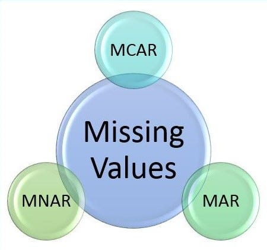

## Introduction: The Reality of Missing Values

Working with data is like solving a complex puzzle, and sometimes, crucial pieces are missing. As someone passionate about data analysis, I've faced this challenge head-on. Missing values in datasets can skew results and undermine accuracy, but with the right approach, they can be managed effectively.

---

## My First Encounter with Missing Values

### A Real-Life Scenario

One of my early projects was analyzing house prices for a class assignment. I was eager to dive in, but I quickly realized many entries were incomplete. Key details like house size, number of bedrooms, and sale prices were missing. Initially, I felt frustrated. It was like trying to solve a mystery with half the clues missing.

---

## Types of Missing Values: A Classroom Revelation

Understanding the different types of missing data was a game-changer. Here’s what I learned:

### MCAR (Missing Completely at Random)

Imagine random pages missing from a book due to printing errors—no pattern to the missing information.

### MAR (Missing at Random)

Think of survey respondents skipping questions based on their length—there’s a predictable pattern related to other variables.

### MNAR (Missing Not at Random)

Consider participants not reporting their income because it’s too low or high—the missing data is dependent on the value itself.

---

## Handling Missing Values: Techniques and Insights

Here are some methods I've used to handle missing values:

### Deleting the Missing Values

#### Dropping Observations

- Simple but can result in significant data loss and potential bias.

#### Dropping Variables

- Useful when the variable isn’t critical, but important information might be lost.

### Imputing the Missing Values

#### Mean/Median Imputation

Replace missing values with the mean or median of the column. For instance, in my house prices project, using the median price helped maintain data integrity.

#### Random Sample Imputation

Fill missing values with randomly selected ones from complete observations. It maintains dataset variability.

#### Multiple Imputation

Using MICE (Multiple Imputation by Chained Equations) during an internship allowed me to handle complex datasets effectively, improving analysis robustness.

---

## Best Practices: Lessons Learned

Here are some best practices I've learned through experience:

- **Understand the Data:** Identify why data is missing and categorize it as MCAR, MAR, or MNAR.
- **Choose the Right Method:** Tailor the imputation method to the type of missing data.
- **Evaluate Impact:** Assess how the chosen method affects your analysis to ensure accuracy.

---

## Conclusion: Embracing the Challenge

Navigating the world of missing data has been a valuable learning experience. With the right knowledge and tools, missing values can be managed effectively, ensuring accurate and reliable insights.

### Happy Analyzing!!!

## References

-[DataCamp](https://www.datacamp.com/tutorial/techniques-to-handle-missing-data-values)
-[Analytics Vidhya](https://www.analyticsvidhya.com/blog/2021/10/handling-missing-value/)
-[geeksforgeeks](https://www.geeksforgeeks.org/ml-handling-missing-values/)
-[Medium](https://medium.com/analytics-vidhya/different-types-of-missing-data-59c87c046bf7)
-[freepic](https://www.freepik.com/premium-vector/happy-man-analyzing-data-her-laptop-sitting-cross-legged-data-science-concept-business-graphs-charts_19849613.htm)

---

## Call to Action

Do you have experiences dealing with missing data? Share your stories in the comments below or connect with me on LinkedIn!
